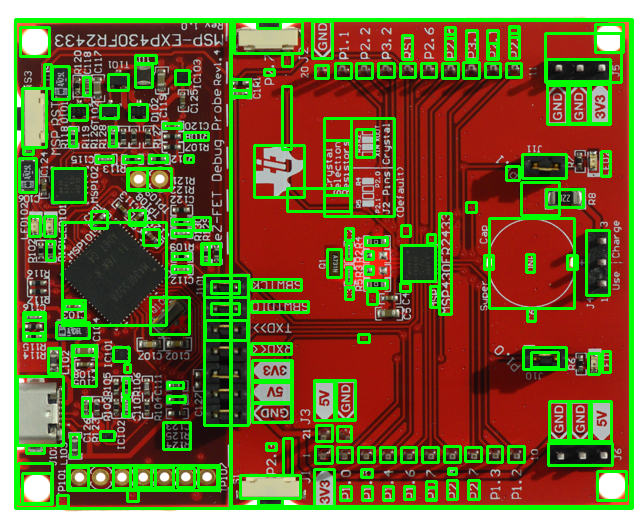

# SAM Object Detection and Extraction Pipeline

A production-ready computer vision pipeline leveraging Meta's Segment Anything Model (SAM) for automatic object detection and isolation. Provides both bounding box visualization and individual object extraction capabilities.

 *Example output showing detected objects*

## Installation Guide (Windows)

1. **Python 3.11** (required for PyTorch CUDA support)  
   [Download from Microsoft Store](https://apps.microsoft.com/detail/python-311/9NRWMJP3RSLX?hl=en-us&gl=US)  
   *Check "Add Python to PATH" during installation*

2. **CUDA 12.1 Toolkit**  
   [Download CUDA 12.1](https://developer.nvidia.com/cuda-12-1-0-download-archive)  
   Verify installation:
   ```cmd
   nvcc --version
   ```

3. **NVIDIA Drivers**  
   Ensure latest drivers for your GPU:  
   [NVIDIA Driver Download](https://www.nvidia.com/Download/index.aspx)

### Package Installation
```bash
# Create virtual environment
python -m venv sam_env
sam_env\Scripts\activate

# Install PyTorch with CUDA 12.1 support
pip install torch torchvision torchaudio --index-url https://download.pytorch.org/whl/cu121

# Install SAM and dependencies
pip install git+https://github.com/facebookresearch/segment-anything.git
pip install opencv-python matplotlib
```

## Usage
Run the script with
```
python sep.py
```

**Output Files**:
   - `boxed_objects.png`: Input image with detection bounding boxes
   - `obj/object_*.png`: Individual cropped objects
   - Console output showing processing statistics

**Example output**:
```
PyTorch Version: 2.6.0.dev20241112+cu121
CUDA Available: True
CUDA Version: 12.1
GPU: NVIDIA GeForce RTX 4060 Ti

PROCESSING SUMMARY
Total time: 4.61 seconds
Objects detected: 198
Time per object: 0.0233s
Output saved: boxed_objects.png and 198 objects in /obj
```

## Data set
https://trust-hub.org/#/data/fics-pcb